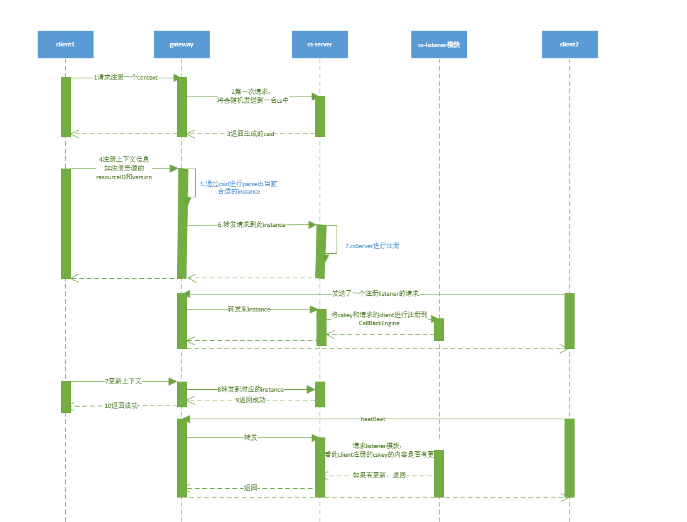
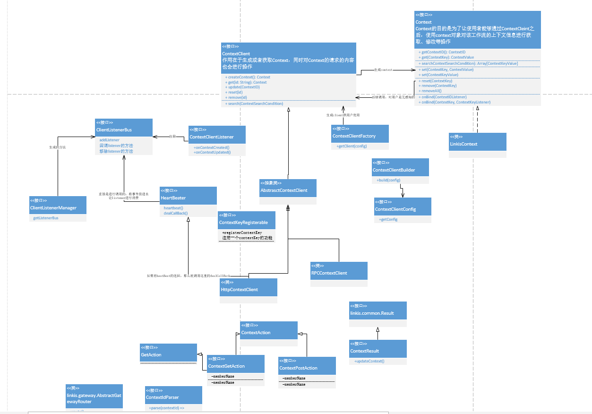
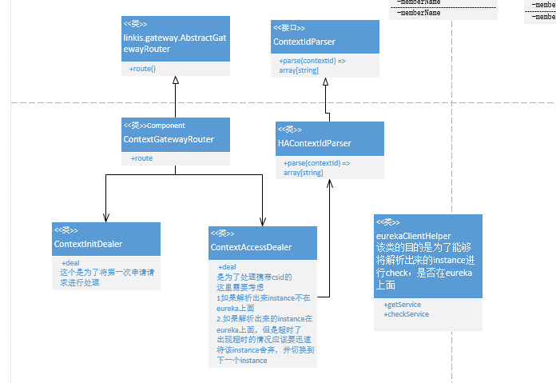

## **CSClient设计的思路和实现**

CSClient是每一个微服务和CSServer组进行交互的客户端，CSClient需要满足下面的功能。

1.  微服务向cs-server申请一个上下文对象的能力

2.  微服务向cs-server注册上下文信息的能力

3.  微服务能够向cs-server更新上下文信息的能力

4.  微服务向cs-server获取上下文信息的能力

5.  某一些特殊的微服务能够嗅探到cs-server中已经修改了上下文信息的操作

6.  CSClient在csserver集群都失败的情况下能够给出明确的指示

7.  CSClient需要提供复制csid1所有上下文信息为一个新的csid2用来提供给调度执行的

>   总体的做法是通过的linkis自带的linkis-httpclient进行发送http请求，通过实现各种Action和Result的实体类进行发送请求和接收响应。

### 1. 申请上下文对象的能力

申请上下文对象，例如用户在前端新建了一条工作流，dss-server需要向dss-server申请一个上下文对象，申请上下文对象的时候，需要将工作流的标识信息(工程名、工作流名)通过CSClient发送到CSServer中(这个时候gateway应该是随机发送给一个的，因为此时没有携带csid的信息)，申请上下文一旦反馈到正确的结果之后，就会返回一个csid和该工作流进行绑定。

### 2. 注册上下文信息的能力

>   注册上下文的能力，例如用户在前端页面上传了资源文件，文件内容上传到dss-server，dss-server将内容存储到bml中，然后需要将从bml中获得的resourceid和version注册到cs-server中，此时需要使用到csclient的注册的能力，注册的能力是通过传入csid，以及cskey
>   和csvalue(resourceid和version)进行注册。

### 3. 更新注册的上下文的能力

>   更新上下文信息的能力。举一个例子，比如一个用户上传了一个资源文件test.jar，此时csserver已经有注册的信息，如果用户在编辑工作流的时候，将这个资源文件进行了更新，那么cs-server需要将这个内容进行更新。此时需要调用csclient的更新的接口

### 4. 获取上下文的能力

注册到csserver的上下文信息，在变量替换、资源文件下载、下游节点调用上游节点产生信息的时候，都是需要被读取的，例如engine端在执行代码的时候，需要进行下载bml的资源，此时需要通过csclient和csserver进行交互，获取到文件在bml中的resourceid和version然后再进行下载。

### 5. 某一些特殊的微服务能够嗅探到cs-server中已经修改了上下文信息的操作

这个操作是基于以下的例子，比如一个widget节点和上游的sql节点是有很强的联动性，用户在sql节点中写了一个sql，sql的结果集的元数据为a,b,c三个字段，后面的widget节点绑定了这个sql，能够在页面中进行对这三个字段的编辑，然后用户更改了sql的语句，元数据变成了a,b,c,d四个字段，此时用户需要手动刷新一下才行。我们希望做到如果脚本做到了改变，那么widget节点能够自动的进行将元数据进行更新。这个一般采用的是listener模式，为了简便，也可以采用心跳的机制进行轮询。

### 6. CSClient需要提供复制csid1所有上下文信息为一个新的csid2用来提供给调度执行的

用户一旦发布一个工程，就是希望对这个工程的所有信息进行类似于git打上一个tag，这里的资源文件、自定义变量这些都是不会再变的，但是有一些动态信息，如产生的结果集等还是会更新csid的内容。所以csclient需要提供一个csid1复制所有上下文信息的接口以供微服务进行调用

## **ClientListener模块的实现**

对于一个client而言，有时候会希望在尽快的时间内知道某一个csid和cskey在cs-server中发生了改变，例如visualis的csclient需要能够知道上一个sql节点进行了改变，那么需要被通知到，服务端有一个listener模块，而客户端也需要一个listener模块，例如一个client希望能够监听到某一个csid的某一个cskey的变化，那么他需要将该cskey注册到对应的csserver实例中的callbackEngine，后续的比如有另外一个client进行更改了该cskey的内容，第一个client进行了heatbeat的时候，callbackengine就需要将这个信息通知到已经client监听的所有cskey，这样的话，第一个client就知道了该cskey的内容已经发生了变化。当heatbeat返回数据的时候，我们就应该通知到注册到ContextClientListenerBus的所有的listener进行使用on方法

## **GatewayRouter的实现**

Gateway插件实现Context进行转发Gateway的插件的转发逻辑是通过的GatewayRouter进行的，需要分成两种方式进行，第一种是申请一个context上下文对象的时候，这个时候，CSClient携带的信息中是没有包含csid的信息的，此时的判断逻辑应该是通过eureka的注册信息，第一次发送的请求将会随机进入到一个微服务实例中。  
第二种情况是携带了ContextID的内容，我们需要将csid进行解析，解析的方式就是通过字符串切割的方法，获取到每一个instance的信息，然后通过instance的信息通过eureka判断是否还存在这个微服务，如果是存在的，就往这个微服务实例进行发送

