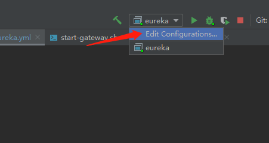
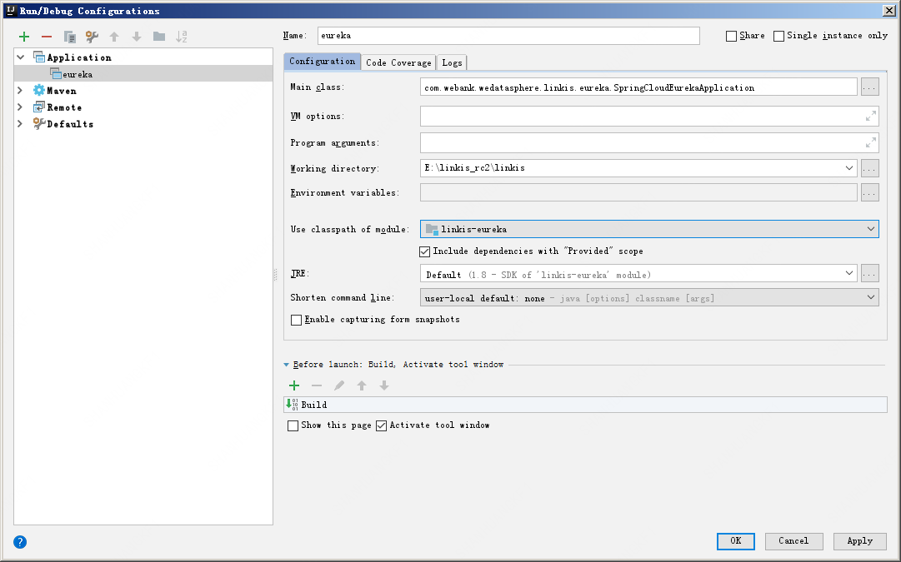
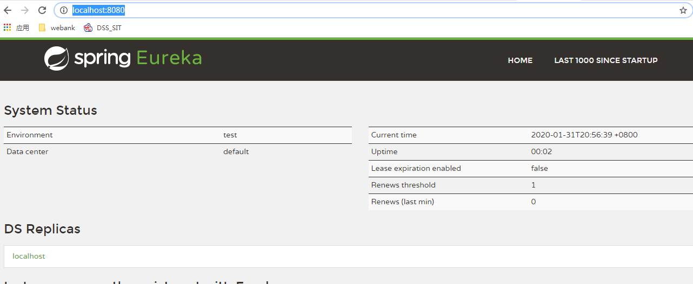
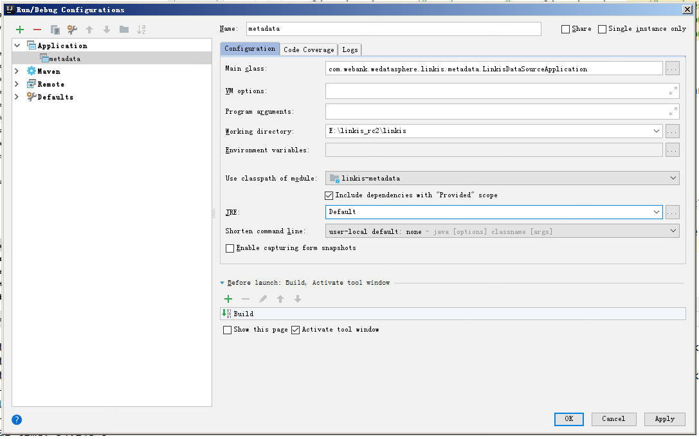
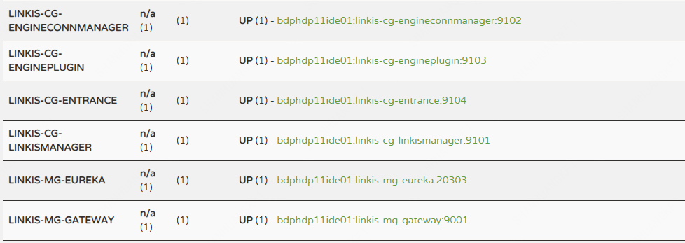
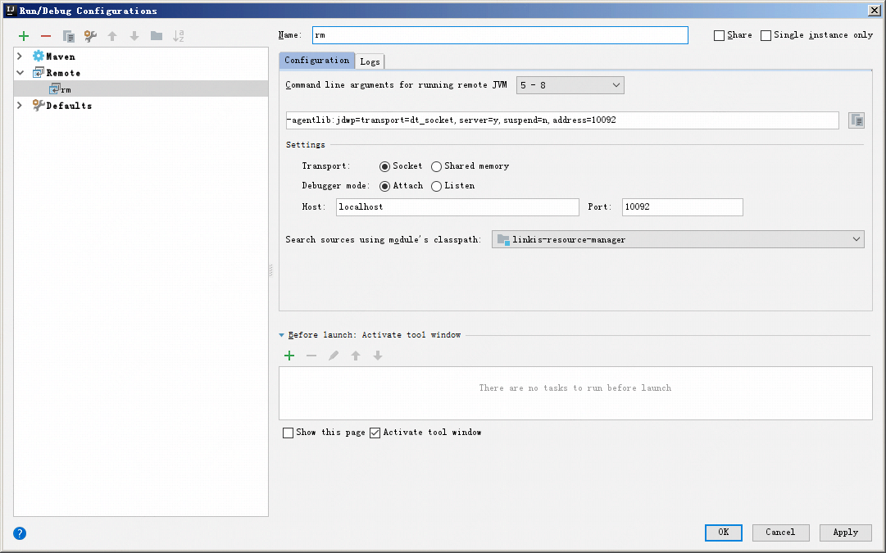

## 一、前言
&nbsp;&nbsp;&nbsp;&nbsp;Linkis的每个微服务都支持调试的，大部分服务都支持本地调试，部分服务只支持远程调试。

1. 支持本地调试的服务
- linkis-mg-eureka：设置的调试Main class是`com.webank.wedatasphere.linkis.eureka.SpringCloudEurekaApplication`
- 其它Linkis微服务分别有自己的Main class，分别如下
    linkis-cg-manager: `com.webank.wedatasphere.linkis.manager.am.LinkisManagerApplication`
    linkis-ps-bml: `com.webank.wedatasphere.linkis.bml.LinkisBMLApplication`
    linkis-ps-cs: `com.webank.wedatasphere.linkis.cs.server.LinkisCSApplication`
    linkis-cg-engineconnmanager: `com.webank.wedatasphere.linkis.ecm.server.LinkisECMApplication`
    linkis-cg-engineplugin: `com.webank.wedatasphere.linkis.engineplugin.server.LinkisEngineConnPluginServer`
    linkis-cg-entrance: `com.webank.wedatasphere.linkis.entrance.LinkisEntranceApplication`
    linkis-ps-publicservice: `com.webank.wedatasphere.linkis.jobhistory.LinkisPublicServiceAppp`
    linkis-ps-datasource: `com.webank.wedatasphere.linkis.metadata.LinkisDataSourceApplication`
    linkis-mg-gateway: `com.webank.wedatasphere.linkis.gateway.springcloud.LinkisGatewayApplication`

2. 只支持远程调试的服务：
EngineConnManager服务以及由ECM启动的Engine服务都只支持远程调试。

## 二、本地调试服务步骤
&nbsp;&nbsp;&nbsp;&nbsp;Linkis和DSS的服务都依赖Eureka，所以需要首先启动Eureka服务，Eureka服务也可以用您已经启动的Eureka。Eureka启动后就可以启动其他服务了。

### 2.1 Eureka服务启动
1. 如果不想默认的20303端口可以修改端口配置：
```yml
文件路径：conf/application-eureka.yml
修改端口：
server:
  port: 8080 ##启动的端口
```
2. 接着在Idea中新增调试配置
可以通过点击Run或者点击下图的Add Configuration

3. 然后点击新增Application并修改信息
首先设置调试的名字：比如Eureka
接着设置Main class：
`com.webank.wedatasphere.linkis.eureka.SpringCloudEurekaApplication`
最后设置该服务的Class Path,对于Eureka的classPath模块是linkis-eureka

4. 接着可以点击Debug按钮启动Eureka服务了，并可以通过：[http://localhost:8080/](http://localhost:8080/)访问Eureka页面


### 2.2 其他服务
1. 需要修改对应服务的Eureka配置，需要修改application.yml文件
```
conf/application-linkis.yml    
```
修改对应的Eureka地址为已经启动的Eureka服务：
```

eureka:
  client:
    serviceUrl:
      defaultZone: http://localhost:8080/eureka/
```
2. 修改linkis相关的配置,通用配置文件在conf/linkis.properties，各模块对应的配置在conf目录下以模块名称开头的properties文件中。

3. 接着新增调试服务
Main Class都统一设置为各模块自己的Main Class，已在前言中列出。
服务的Class Path为对应的模块：
```
    linkis-cg-manager: linkis-application-manager
    linkis-ps-bml: linkis-bml
    linkis-ps-cs: `com.webank.wedatasphere.linkis.cs.server.LinkisCSApplication`
    linkis-cg-engineconnmanager: linkis-cs-server
    linkis-cg-engineplugin: linkis-engineconn-plugin-server
    linkis-cg-entrance: linkis-entrance
    linkis-ps-publicservice: linkis-jobhistory
    linkis-ps-datasource: linkis-metadata
    linkis-mg-gateway: linkis-spring-cloud-gateway
```
并勾选provide：



4. 接着启动服务，可以看到服务在Eureka页面进行注册：



令外linkis-ps-publicservice需要在pom里面加入public-Module模块。
```
<dependency>
 <groupId>com.webank.wedatasphere.linkis</groupId>
 <artifactId>public-module</artifactId>
 <version>${linkis.version}</version>
</dependency>
```
## 三、远程调试服务步骤
&nbsp;&nbsp;&nbsp;&nbsp;每个服务都支持远程调试，但是需要提前打开远程调试。远程调试分为两种情况，一种是Linkis普通服务的远程调试，另一种是EngineConn的远程调试，以下分别阐述：
1. 普通服务的远程调试：
    a.  首先修改sbin/ext目录下的对应服务的启动脚本文件，添加调试端口：
```
export $SERVER_JAVA_OPTS =" -agentlib:jdwp=transport=dt_socket,server=y,suspend=n,address=10092"
```
添加的内容为： `-agentlib:jdwp=transport=dt_socket,server=y,suspend=n,address=10092` 其中端口可能冲突，可以修改为可用的端口。
      b. 接着在idea里面新建一个远程调试，首先选择remote，然后增加服务的host和端口，接着选择调试的模块

3. 接着点击debug按钮就可以完成远程调试了

      
2. EngineConn的远程调试：
    a. 在EngineConn对应的linkis-engineconn.properties文件中，添加以下配置项
```
wds.linkis.engineconn.debug.enable=true
```
该配置项会在EngineConn启动时，随机分配一个debug端口。 
      b. 在EngineConn的日志第一行，会打印出实际分配的端口。
```
      Listening for transport dt_socket at address: 26072
```
      
   c. 在idea里新建一个远程调试，在前面已经介绍过步骤，在此不再赘述。
 
