# Linkis 1.0使用方法与Client介绍

### 目录
<!-- TOC -->

- [1. Linkis1.0的几种使用方式](#1-linkis10的几种使用方式)
    - [1.1 直接使用Linkis执行任务](#11-直接使用linkis执行任务)
        - [1.1.1 restful接口](#111-restful接口)
        - [1.1.2 sdk api和jdbc接口](#112-sdk-api和jdbc接口)
        - [1.1.3 linkis-client命令提交](#113-linkis-client命令提交)
    - [1.2 通过DSS的Scriptis（意书）提交执行](#12-通过dss的scriptis意书提交执行)
    - [1.3 通过DSS的工作流提交执行](#13-通过dss的工作流提交执行)
    - [1.3 DSS的扩展执行](#13-dss的扩展执行)
- [2. Linkis 0.9.x 和 Linkis 1.0 Client使用区别](#2-linkis-09x-和-linkis-10-client使用区别)
    - [2.1 Linkis 0.9.X Client使用示例 （github文档： Linkis 0.X Java SDK使用文档）](#21-linkis-09x-client使用示例-github文档-linkis-0x-java-sdk使用文档)
    - [2.2 Linkis 1.0 执行任务新增submit接口](#22-linkis-10-执行任务新增submit接口)
        - [2.2.1 http接口示例](#221-http接口示例)
        - [2.2.2 SDK API示例 （github Linkis1.0用户使用文档）](#222-sdk-api示例-github-linkis10用户使用文档)
    - [2.3 Linkis 1.0对0.9.X 的execute兼容原理](#23-linkis-10对09x-的execute兼容原理)
- [3. Linkis 1.0 标签化请求](#3-linkis-10-标签化请求)
    - [3.1 标签化简介](#31-标签化简介)
    - [3.2 基于标签请求](#32-基于标签请求)
        - [3.2.1 Gateway标签转换](#321-gateway标签转换)
        - [3.2.2 LinkisManager 标签判断](#322-linkismanager-标签判断)
        - [3.2.3 EngineConn启动标签参数](#323-engineconn启动标签参数)
        - [3.2.4 多租户标签的使用](#324-多租户标签的使用)
- [4. Linkis 1.0 管理台新变化](#4-linkis-10-管理台新变化)
    - [4.1 历史管理新增日志管理员](#41-历史管理新增日志管理员)
    - [4.2 细化资源管理](#42-细化资源管理)
    - [4.3 新增自定义参数配置](#43-新增自定义参数配置)
    - [4.4全局变量](#44全局变量)
    - [4.5 ECM管理](#45-ecm管理)
    - [4.6 微服务管理](#46-微服务管理)

<!-- /TOC -->

Linkis1.0目前已发◊布RC1版本，里面主要内容是计算治理增强。RC2版本主要内容是Orchestrator计算编排，Client改造和Entrance新接口加入内容将在RC2版本发布，该版本正在火热开发测试中。

# 1. Linkis1.0的几种使用方式

## 1.1 直接使用Linkis执行任务

统一的restful、sdk api、jdbc接口

### 1.1.1 restful接口 

支持http、websocket协议

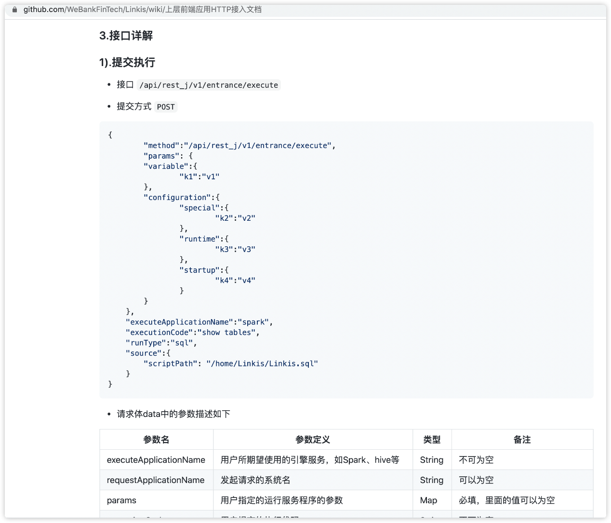

### 1.1.2 sdk api和jdbc接口

标准client
sdk和jdbc都对①中的接口进行封装，提供jar，支持java和scala应用调用。不过，jdbc支持jdbc协议连接。下图是标准SDK
API的scala demo应用。

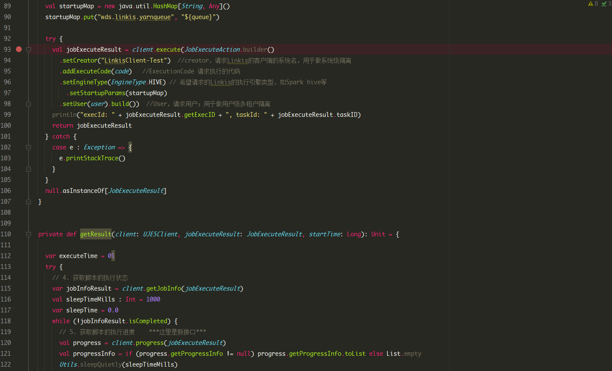

下图是Jdbc连接demo。

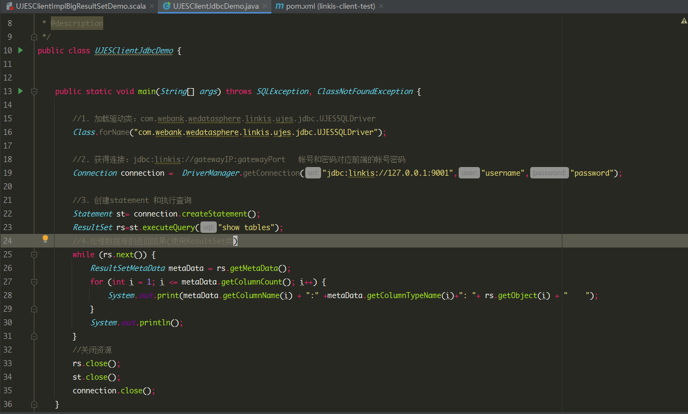

Jdbc计划添加新的参数，支持发送到不同类型的linkis引擎。jdbc:linkis://ip:8088/?engineType=spark

### 1.1.3 linkis-client命令提交

后续版本新增富客户端linkis-client，随linkis一起安装，支持shell调用。安装linkis时，只需要将linkis.properties配置为远程linkis的地址，即可使用远程服务。

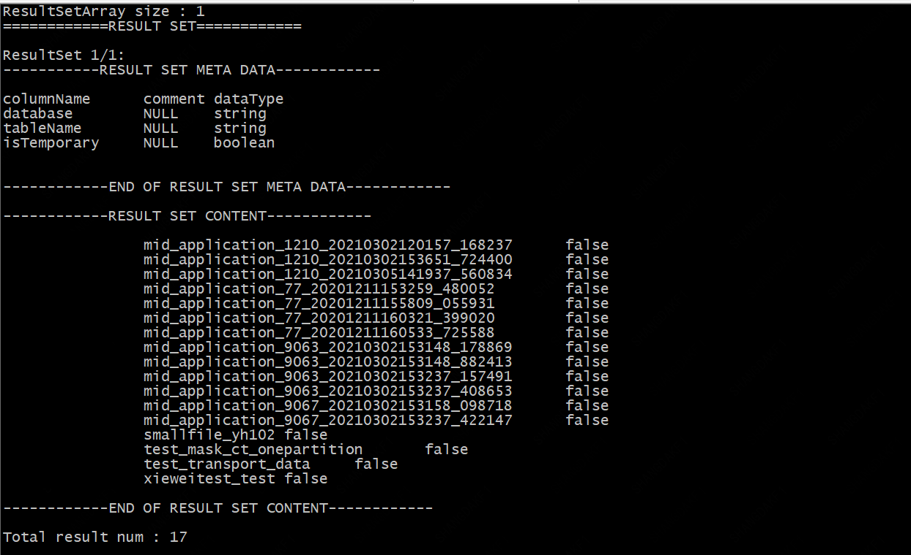

## 1.2 通过DSS的Scriptis（意书）提交执行

通过Scritpis提交执行，是数据开发常用方式。

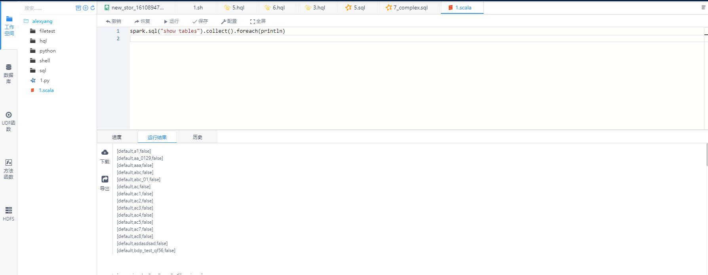

## 1.3 通过DSS的工作流提交执行

DSS工作流提交均通过FlowExecutionService提供服务，服务为SDK API的封装。

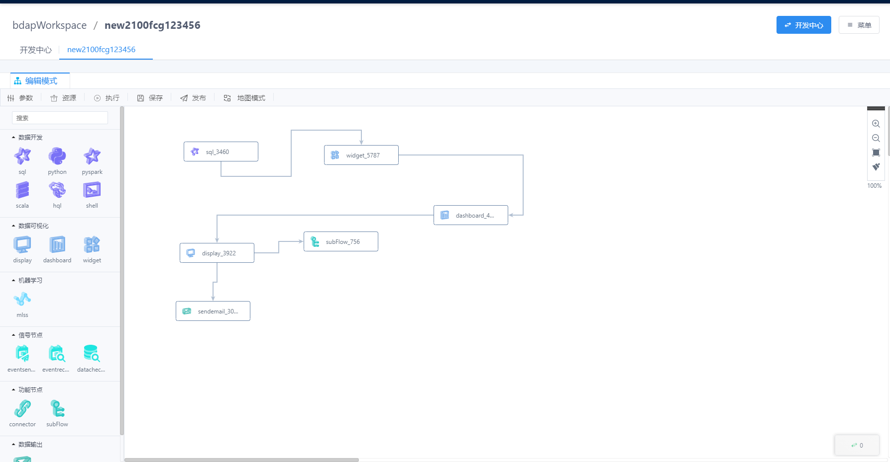

## 1.3 DSS的扩展执行

根据DSS AppJoint协议，将第三方组件数据任务转化为linkis任务，通过SDK
API提交到Linkis执行。

# 2. Linkis 0.9.x 和 Linkis 1.0 Client使用区别

## 2.1 Linkis 0.9.X Client使用示例 （github文档： Linkis 0.X Java SDK使用文档）

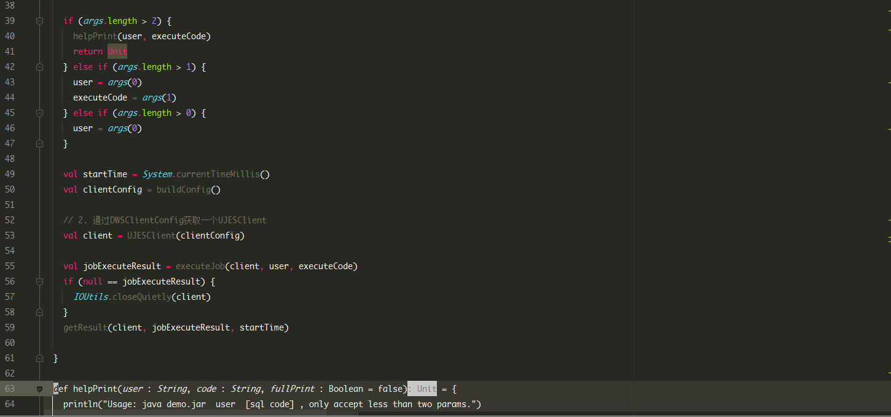

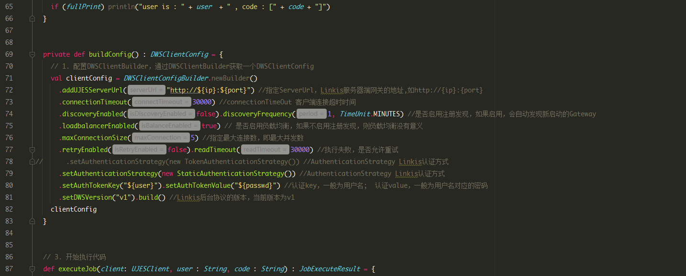

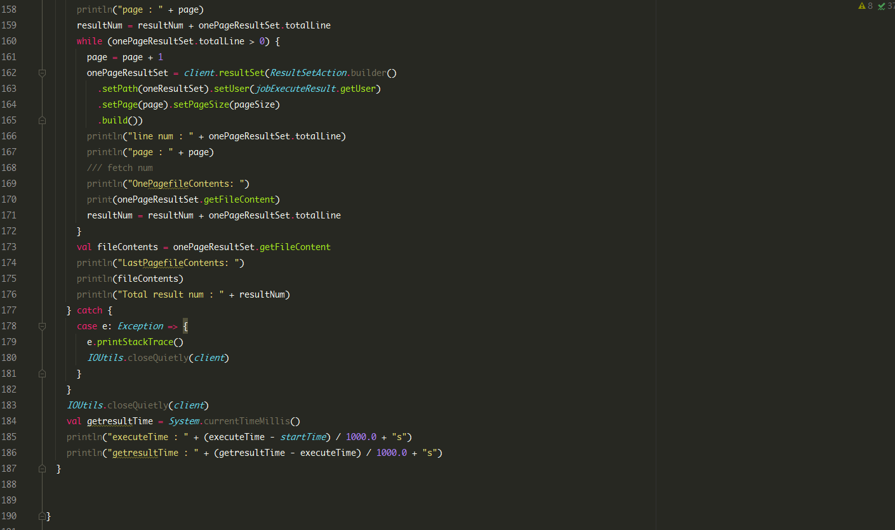

## 2.2 Linkis 1.0 执行任务新增submit接口

### 2.2.1 http接口示例

老接口（兼容）：

/api/rest_j/v1/entrance/execute

{

executeApplicationName: "hive"，

executionCode: "show tables;"，

params: {variable: {}, configuration: {}}，

runType: "hql"，

source: {scriptPath: "file:///tmp/linkis/hadoop/1.hql"}

}

新接口（推荐）：

/api/rest_j/v1/entrance/submit  
{  
executionContent: ｛code: "show tables;", runType: "sql"｝，  
params: {variable: {}, configuration: {}}，  
source: {scriptPath: "file:///tmp/linkis/hadoop/1.hql"}，  
"labels":{  
engineType: "spark-2.4.3",  
userCreator: "user1-IDE"  
}  
}

### 2.2.2 SDK API示例 （github Linkis1.0用户使用文档）

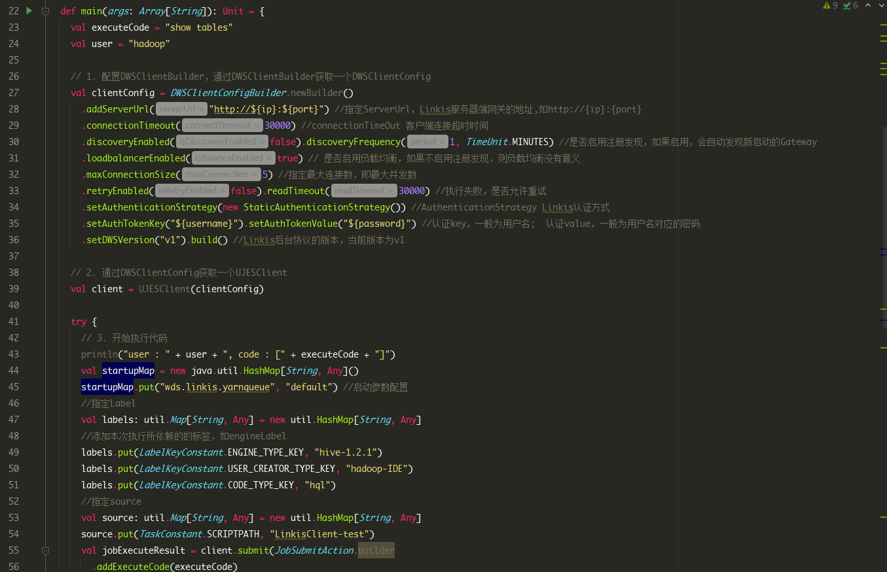

## 2.3 Linkis 1.0对0.9.X 的execute兼容原理

通过执行内容标记：executionContent来区分新老接口。老接口会根据关键字段拼接出需要的标签
UserCreatorLabel、EngineTypeLabel和CodeTypeLabel。新接口需要直接传入标签，如图

"labels":{  
engineType: "spark-2.4.3",  
userCreator: "hadoop-IDE"  
}

# 3. Linkis 1.0 标签化请求

## 3.1 标签化简介

标签是一种附加参数，在Linkis1.0里面主要用于匹配引擎、匹配gateway实例。标签相关接口如下：

①Label是所有标签的基类，有三个基础方法：

1.  getLabelKey()：用于标识一个标签的类别，例如EngineTypeLabel，其labelKey为：engineType。

2.  getValue()：用于标识一个标签的实际值，例如EngineTypeLabel，其value为：{"engine":
    "Spark", "version":"2.4.3"}；

3.  getStringValue()：用于打印该标签的值，例如EngineTypeLabel，如果value为{"engine":
    "Spark", "version":"2.4.3"}，则其stringValue为Spark-2.4.3。

4.  getFeature()：用于标识一个标签的特征，主要用于做过滤获取节点时，确认该标签的作用域，包含的含义如上图解释。

②LabelBuilder用于构建一个或多个Label，原则上，所有的标签都应该通过LabelBuilder构建出来。

③LabelFactory用于通过key和value来获取一个Label，需要注意的是，value是一个object类型。

其他所有的标签，都是基于次级标签NodeLabel、JobLabel、UserLabel和ResourceLabel构建出来的

标签化之后，可以提供多引擎支持，且引擎支持多版本，多集群，支持路由EngineConnManager等等。目前可以方便扩至：固定引擎标签，多租户标签。

## 3.2 基于标签请求

### 3.2.1 Gateway标签转换

Gateway通过预配置的RouteLabel标签来选择对应实例，再转发到对应的服务。后期会增加固定EngineConnManager和固定EngineConn的标签，也是Gateway这里支持

### 3.2.2 LinkisManager 标签判断

LinkisManager里面有标签管理器，提供标签管理工具。AppManager会使用标签来选择和匹配EngineConnManager和EngineConn。

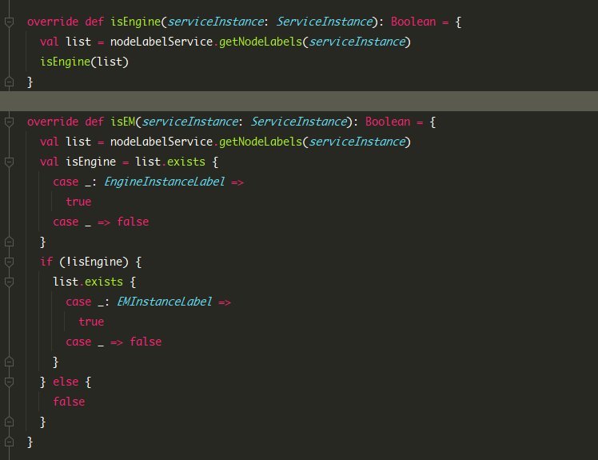

### 3.2.3 EngineConn启动标签参数

EngineConn里面，启动引擎时会根据传入的标签参数，来匹配和启动引擎。

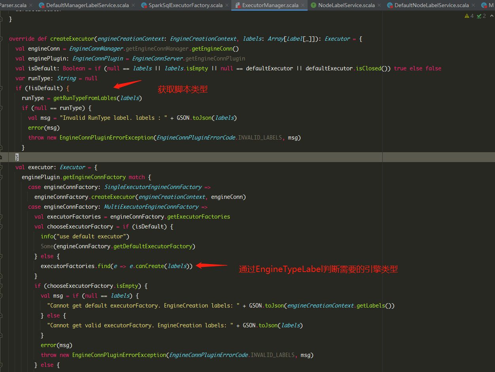

### 3.2.4 多租户标签的使用

标签功能已实现，多租户功能的使用：①配置ECM；②提交任务带上；

# 4. Linkis 1.0 管理台新变化

## 4.1 历史管理新增日志管理员

## 4.2 细化资源管理

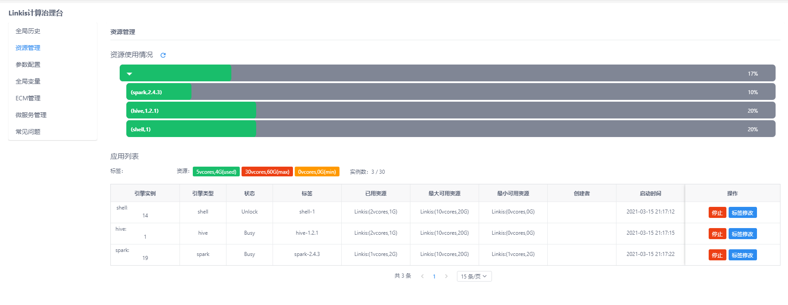

## 4.3 新增自定义参数配置

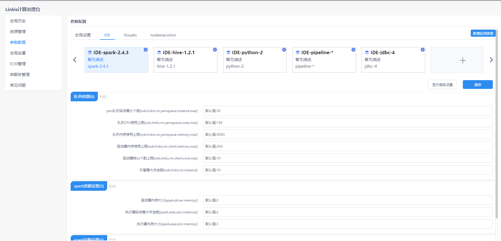

## 4.4全局变量

## 4.5 ECM管理

管理页面默认可以看到已启动的EngineConnManager服务实例，可以进行标签增删改，还可以点击实例，观察某个EngineConnManager启动的EngineConn实例。

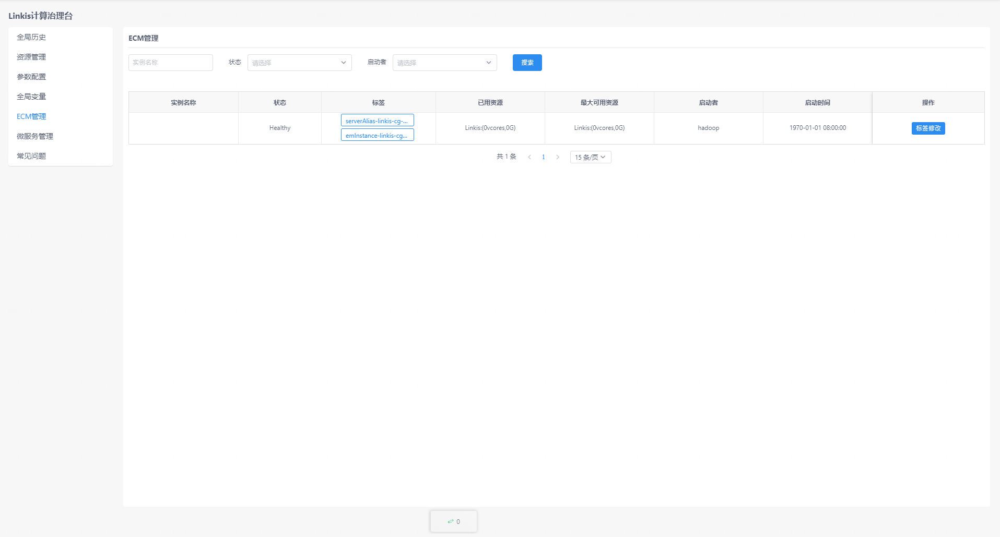

修改EngineConnManager的标签。

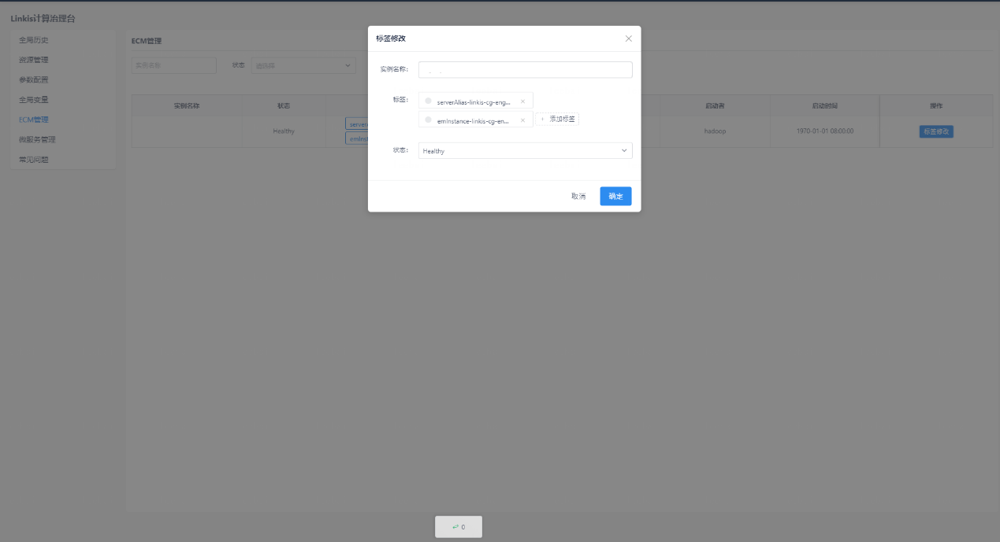

观察EngineConnManager启动的引擎。

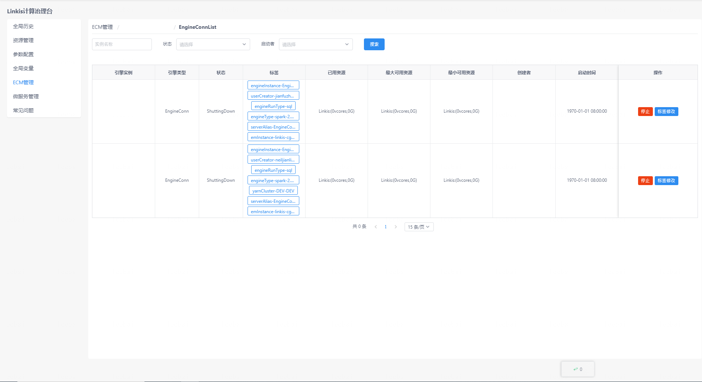

## 4.6 微服务管理

